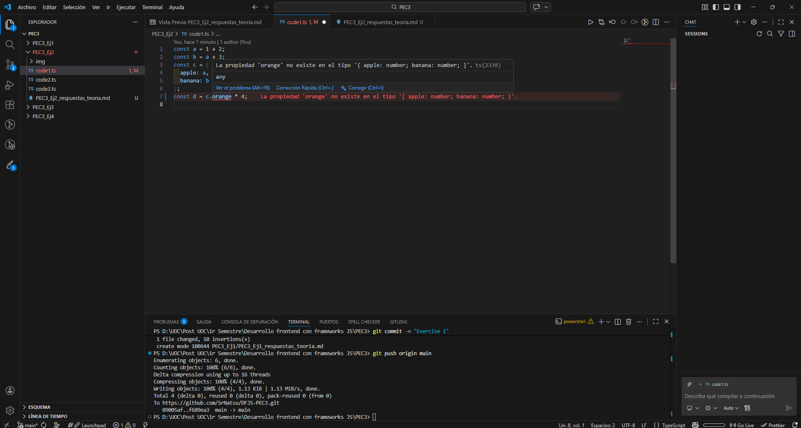

# Ejercicio 2

## Modifica el código para conseguir que aparezca una línea roja de error en el IDE avisándote de que se está disparando un ```TypeError```. Toma una captura de pantalla de tu resultado y haz que se muestre dentro del fichero ```PEC3_Ej2_respuestas_teoria.md```. Dentro de este mismo documento explica por qué se ha producido esto y qué ventajas tiene.



Al sustituir ```c.apple``` por ```c.orange``` se dispara un TypeError, ya que ```c``` no contiene la propiedad ```orange```. Esto ocurre porque TypeScript detecta este tipo de error antes de que el código se ejecute.

## Para cada uno de los valores del fichero ```code2.ts```, ¿Qué tipo de datos inferirá TypeScript? Explica por qué se ha inferido este tipo de datos.

* **```const a = 1042;```** -> Detecta un número entero e infiere ```number```.
* **```const b = 'apples and oranges';```** -> Detecta una cadena de caracteres e infiere ```string```.
* **```const c = 'pineapples';```** -> Detecta una cadena de caracteres e infiere ```string```.
* **```const d = [true, true, false];```** -> Detecta un array de booleanos e infiere ```boolean[]```.
* **```const e = { type: 'ficus' };```** -> Detecta un objeto con una clave ```type``` y un valor de tipo ```string``` e infiere ```{ type: string }```.
* **```const f = [1, false];```** -> Detecta un array que contiene números y booleanos e infiere ```(number | boolean)[]```.
* **```const g = [3];```** -> Detecta un array que contiene números e infiere ```number[]```.
* **```const h = null;```** -> Detecta el valor ```null``` y, dependiendo de la configuración del compilador infiere ```any``` o ```null```.

## ¿Por qué se dispara cada uno de los errores del fichero ```code3.ts```?

* **```const i: 3 = 3; i = 4;```** -> Porque ```i``` es una constante y no se puede modificar su valor.
* **```const j = [1,2,3]; j.push(4); j.push('5');```** -> Porque j es un Array de números, por lo que no acepta valores de tipo ```string```.
* **```let k: never = 4;```** -> El tipo ```never``` representa un valor que nunca puede ocurrir, es decir, no permite que una variable tenga un valor válido.
* **```let l: unknown = 4; let m = l * 2;```** -> El tipo ```unknown``` se utiliza cuando no se sabe de qué tipo será la variable mientras se programa. Por lo tanto, no se puede multiplicar un número con una variable tipo desconocido.

## ¿Cuál es la diferencia entre una clase y una interface en TypeScript?

Las **interfaces** solo existen durante la compilación para verificar tipos y desaparecen en JavaScript. Sirven para definir la estructura de un objeto sin implementación.

Las **clases** existen en tiempo de ejecución, permitiendo inicializar propiedades, implementar métodos y crear instancias con ```new```. Sirven para implementar lógica.